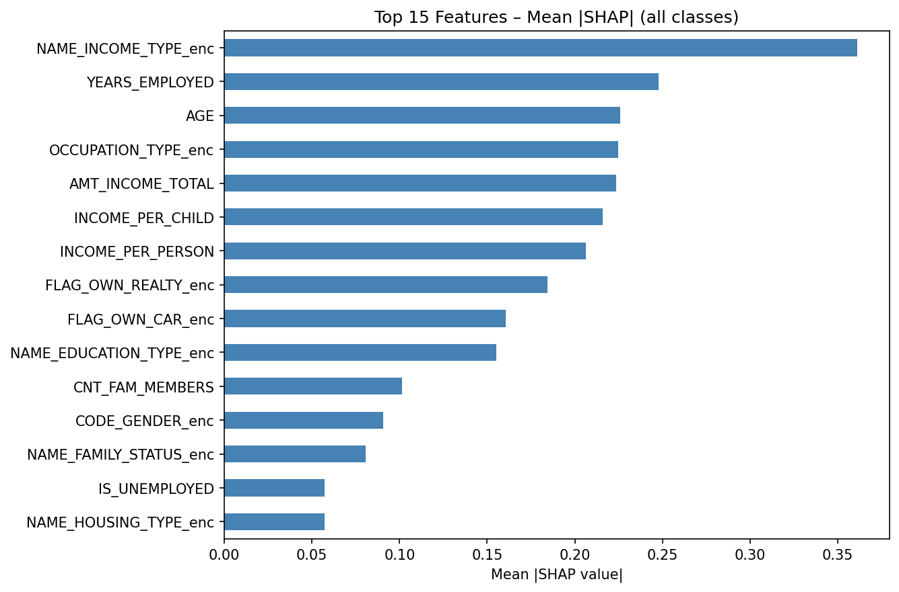
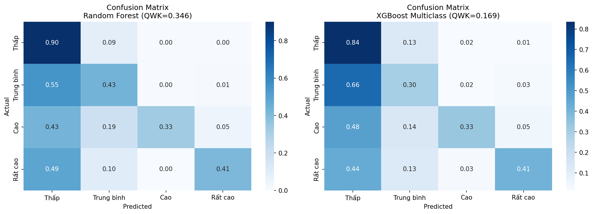

# Phân loại rủi ro tín dụng đa lớp

*Multiclass credit-risk classification on the Kaggle Credit Card Approval dataset. Group project, M.Sc. Fintech, Banking University of Ho Chi Minh City, 2026.*

## Bài toán

Xếp khách hàng thẻ tín dụng vào 4 mức rủi ro (Thấp, Trung bình, Cao, Rất cao) **chỉ từ thông tin hồ sơ đăng ký**, như tình huống một ngân hàng cần đánh giá khách hàng mới chưa có lịch sử trả nợ.

## Dữ liệu

Bộ *Credit Card Approval Prediction* trên Kaggle, gồm hai bảng:

| File | Nội dung | Số dòng |
|---|---|---|
| `application_record.csv` | Hồ sơ đăng ký: thu nhập, tuổi, thâm niên, học vấn, nhà ở, gia đình | 438.557 |
| `credit_record.csv` | Tình trạng trả nợ theo từng tháng của mỗi khách hàng | 1.048.575 |

Dữ liệu không đi kèm repo. Tải về và đặt hai file cạnh `credit_risk_pipeline.py`.

## Cách tạo nhãn

Nhãn được dựng từ mức quá hạn cao nhất trong lịch sử trả nợ, theo tinh thần phân nhóm nợ của Thông tư 11/2021/TT-NHNN:

| Mức rủi ro | Điều kiện trong lịch sử trả nợ |
|---|---|
| Thấp | Chưa từng quá hạn từ 30 ngày trở lên |
| Trung bình | Quá hạn tối đa 30 – 89 ngày |
| Cao | Quá hạn tối đa 90 – 149 ngày, và không quá 2 tháng ở mức từ 90 ngày |
| Rất cao | Nợ xấu hoặc xóa nợ, hoặc quá hạn từ 90 ngày trong hơn 2 tháng |

Thông tin lịch sử trả nợ chỉ dùng để tạo nhãn, không đưa vào đầu vào của mô hình, để tránh rò rỉ dữ liệu.

## Cách làm

- Đầu vào gồm các đặc trưng từ hồ sơ, thêm vài đặc trưng tự tạo: tuổi, số năm làm việc, cờ thất nghiệp, thu nhập trên mỗi thành viên gia đình.
- Chia 80/20 có phân tầng theo nhãn. Mất cân bằng lớp được xử lý bằng SMOTE-Tomek, chỉ áp dụng trên tập huấn luyện.
- So sánh 5 mô hình: Logistic Regression, Random Forest, XGBoost, LightGBM và XGBoost thứ bậc (tách thành 3 bài toán nhị phân theo cách Frank-Hall, để tận dụng thứ tự của các mức rủi ro).
- Đánh giá bằng độ chính xác, macro F1, weighted F1 và QWK (quadratic weighted kappa, phạt nặng hơn khi dự đoán lệch nhiều mức).
- Diễn giải bằng SHAP trên mô hình XGBoost, và kiểm tra độ công bằng của mô hình tốt nhất theo giới tính và nhóm tuổi.

## Kết quả

Trên tập kiểm tra (7.292 khách hàng):

| Mô hình | Độ chính xác | Macro F1 | Weighted F1 | QWK |
|---|---|---|---|---|
| **Random Forest** | **0,846** | **0,479** | **0,852** | **0,346** |
| LightGBM | 0,783 | 0,366 | 0,804 | 0,181 |
| XGBoost | 0,773 | 0,349 | 0,796 | 0,169 |
| XGBoost thứ bậc | 0,750 | 0,347 | 0,781 | 0,155 |
| Logistic Regression | 0,258 | 0,144 | 0,375 | 0,006 |

F1 theo từng mức rủi ro của Random Forest: Thấp 0,913 · Trung bình 0,397 · Cao 0,250 · Rất cao 0,356.

Điều rút ra:

1. Độ chính xác 0,85 dễ gây hiểu nhầm. Phần lớn khách hàng thuộc mức Thấp, và mô hình nhận diện tốt nhóm này, nhưng yếu ở các mức rủi ro cao hơn. Vì vậy macro F1 và QWK phản ánh chất lượng mô hình sát hơn.
2. Chỉ dựa vào thông tin hồ sơ thì khó phân biệt các mức rủi ro cao. Đây là giới hạn của bài toán đánh giá khách hàng mới, không chỉ của mô hình.
3. Kiểm tra độ công bằng: macro F1 của Random Forest là 0,45 ở nhóm nữ và 0,51 ở nhóm nam, dao động từ 0,43 đến 0,56 giữa các nhóm tuổi.





## Chạy lại

```
pip install -r requirements.txt
python credit_risk_pipeline.py
```

Kết quả được ghi vào thư mục `results/`: bảng so sánh mô hình, F1 theo lớp, ma trận nhầm lẫn, hình SHAP và dữ liệu kiểm tra độ công bằng.

## Công cụ

Python, pandas, scikit-learn, XGBoost, LightGBM, imbalanced-learn, SHAP, matplotlib, seaborn.
